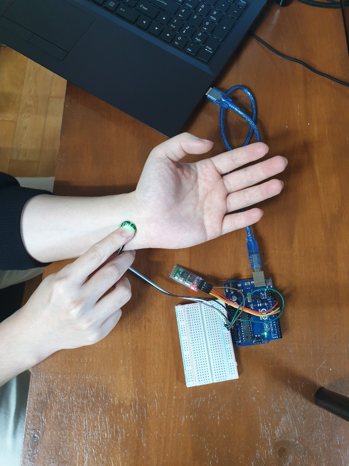
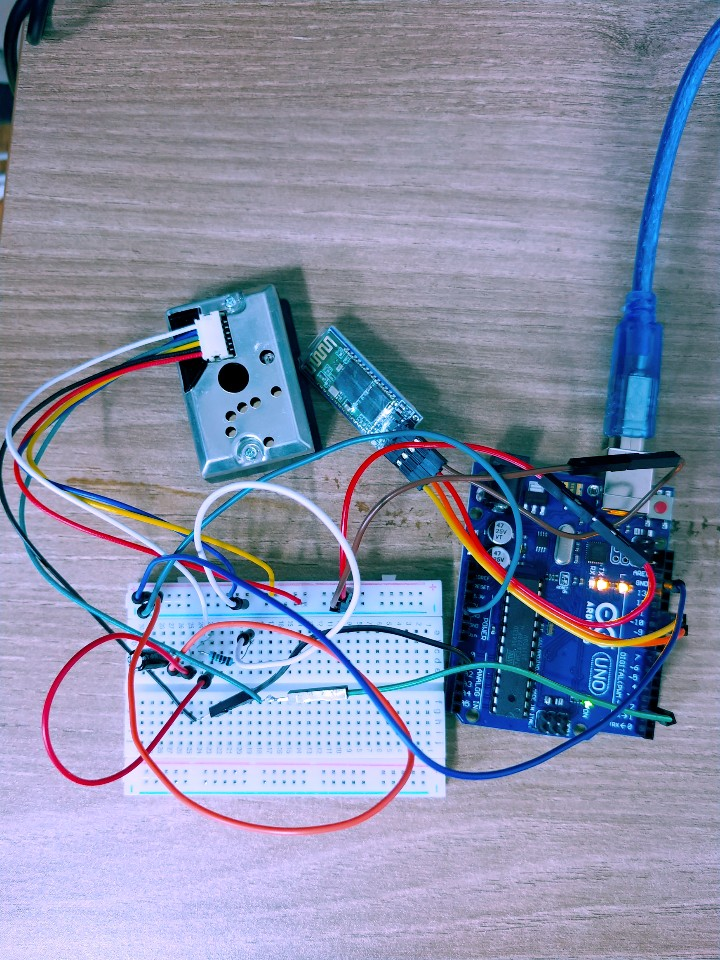
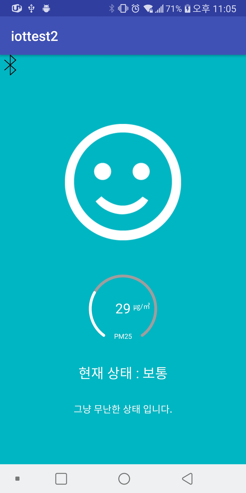
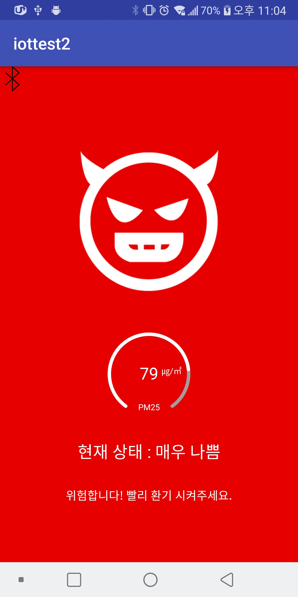
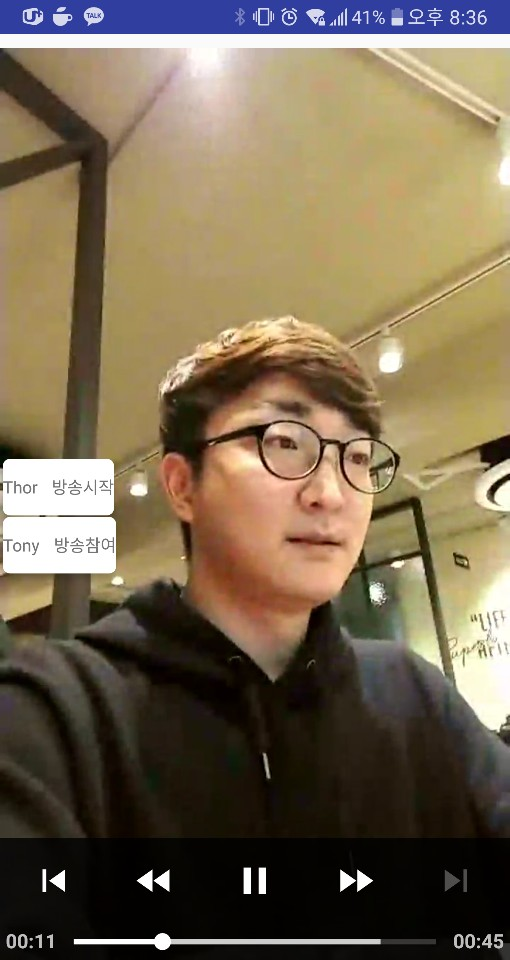
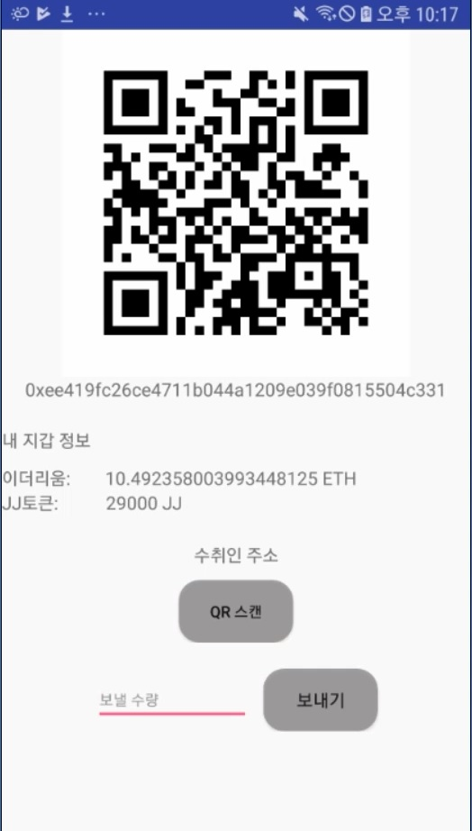
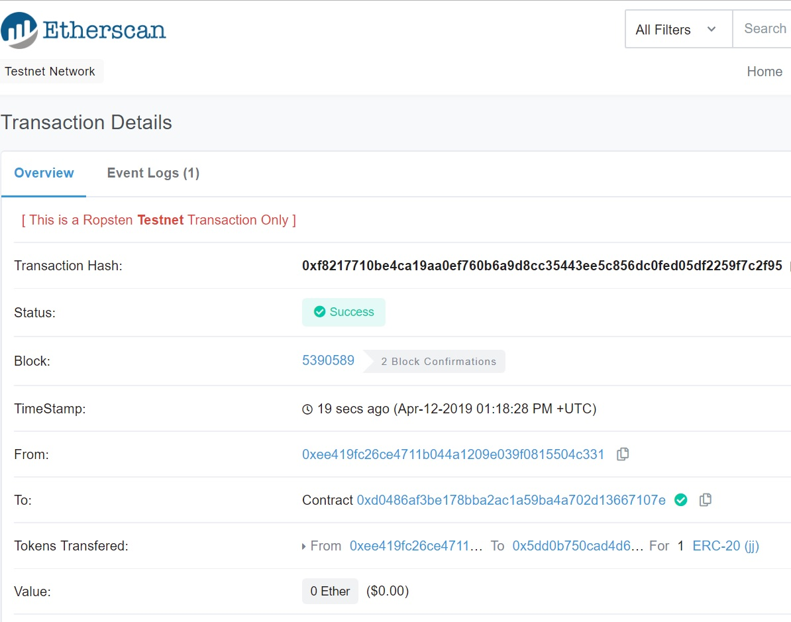

## Takecare

독거노인, 노약자 대상 CCTV 어플리케이션

주요기능 : 실시간 스트리밍, VOD재생, 이더리움 기반 토큰전송, 미세먼지 측정, 심박수 측정

1. 심박수 측정 : 심장박동 측정 후 그래프로 확인
  

2. 미세먼지 측정 : 실내 미세먼지 측정 후 현재 상태 확인
   

3. 실시간 스트리밍 : WebRTC 프로토콜을 이용한 1:N 스트리밍

4. VOD재생 : HLS 프로토콜, EXOplayer 라이브러리를 이용해서 녹화된 영상 재생

5. 이더리움 기반 토큰전송 : 이더리움 기반(ERC-20) 자체 토큰을 발행 사용자들끼리 거래 가능
     

